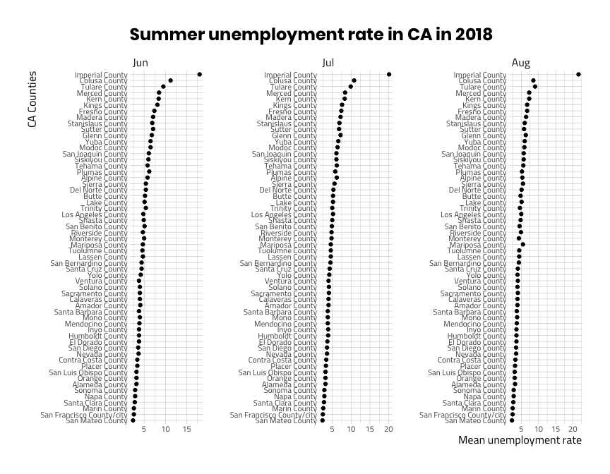

README - Patchwise labs
================

## Quick Background

> Patchwise Labs is a creative strategy firm focused on innovation
> related to the ‘social determinants’ of health (sdoh). Think about all
> the things that keep us unhealthy, and then how little a doctor or
> insurance company can typically solve for. We consult, strategize,
> evangelize on new ways for healthcare to move ‘upstream’ to prevent
> illness at its sources, related to food, housing, income, education,
> and other issues.

## Project Opportunity

> I’m looking for some technical assistance via subcontractor on an
> inbound project. In essence: the prospect is looking for expertise on
> which publicly available sdoh datasets to include as part of their
> data platform (e.g. housing data, census, etc.) that they license out
> to researchers and health systems.

> Once I help them identify and prioritize these datasets, they want me
> to download them, re-format/transform them as necessary, then upload
> them to their platform via BigQuery. Nothing too difficult; the only
> other details to share at this stage are that the datasets are
> probably going to be quite big (e.g. [this census dataset on
> employment/unemployment](https://stats.bls.gov/web/metro/laucntycur14.txt)),
> and that they will need to be refreshed every few months, so there’s a
> long-tail aspect to it as well.

> I’d be looking to subcontract out the data side of this to a third
> party. My ideal preference is a firm that I can trust to own this
> portion of the project. The most important factors to me would be:

> **quality**: making sure data is clean and accurately uploaded

> **responsiveness**: easy to communicate with and quick to reply/make
> changes, especially at the early phases of initiating the first few
> uploads.

> **longevity**: not a one-and-done uploading sprint, but rather a long
> term partner who will be able to take this on in an ongoing basis.

### Other Details

> start date: At this stage I’m still nailing down the details and
> finalizing terms of the contract, but realistically we’d be looking to
> kick things off in November.

> pricing structure: How would you approach the structure of pricing for
> this type of work? Let’s use the dataset above as an example, and
> assume there would be 2 of these on your plate per month for the next
> 6 months of Nov-April, either uploading new data or refreshing
> existing datasets (the numbers are purely hypothetical - just for sake
> of simple math)

> working style/cadence: how would we be collaborating on this - e-mail,
> slack, standing call, etc?

> Any questions for me? I’m under NDA so this is just about as much as I
> can share at this stage, but glad to discuss specific
> parameters/details above by e-mail or if need be, phone call.

> Again - I know transforming & uploading data isn’t the most exciting
> or lucrative opportunity for you, so if you feel it’s not a good fit,
> please just be direct with me. I’m sure there will be other
> opportunities for us to collaborate in the future, too.

> Look forward to hearing from you either way - thanks for reading the
> long e-mail.

-----

# Import

These data are in a pipe-delimited file stored at this link:

``` r
laucntycur14_data_url <- "https://stats.bls.gov/web/metro/laucntycur14.txt"
```

We can download these data to see how large the file is:

``` r
utils::download.file(url = laucntycur14_data_url,
                     destfile = paste0("data/", 
                     base::noquote(lubridate::today()),
                     "-laucntycur14.txt"))
```

The file size is 5.8 MB–not tiny but not huge.

## Data structure

These data have a few problem areas–the column names are split and the
dates are in an unconventional format.

``` r
# fs::dir_tree("data")
Laucntycur14RAW <- readr::read_delim("data/2019-10-01-laucntycur14.txt", 
    "|", escape_double = FALSE, 
    col_names = c("laus_area_code", "state_fips_codes",
                  "county_fips_codes", "area_title",
                  "period", "civilian_labor_force",
                  "employed", "unemployed_level",
                  "unemployed_rate"), 
    skip = 3)
```

    #>  Parsed with column specification:
    #>  cols(
    #>    laus_area_code = col_character(),
    #>    state_fips_codes = col_character(),
    #>    county_fips_codes = col_character(),
    #>    area_title = col_character(),
    #>    period = col_character(),
    #>    civilian_labor_force = col_character(),
    #>    employed = col_character(),
    #>    unemployed_level = col_character(),
    #>    unemployed_rate = col_character()
    #>  )

## Wrangle imported data

Now we can clean up these imported data.

``` r
Laucntycur14RAW %>% utils::head(10)
```

This shows that the first three lines are meta data–we can clean these
with a little filtering. I am going to limit these data to those with a
LAUS area code with a `CN` pefix.

``` r
Laucntycur14 <- Laucntycur14RAW %>% 
    dplyr::filter(stringr::str_detect(string = laus_area_code, 
                                       pattern = 'CN'))
Laucntycur14 %>% utils::head(10)
```

### Trim all white space

This is a quick fix with a little iteration from `purrr`.

``` r
Laucntycur14 <- purrr:::map_df(.x = Laucntycur14, .f = stringr::str_trim)
Laucntycur14 %>% glimpse(78)
```

## Format variables

This will format the variables in the entire data frame.

``` r
Laucntycur14 <- Laucntycur14 %>% 
   dplyr::mutate(
       # civilian labor force -----
   civilian_labor_force = stringr::str_remove_all(string = civilian_labor_force,
                                                  pattern = ","),
     civilian_labor_force = as.double(civilian_labor_force),
    
      # employed -----
   employed = stringr::str_remove_all(string = employed,
                                                  pattern = ","),
     employed = as.double(employed),
   
     # unemployed_level -----
   unemployed_level = stringr::str_remove_all(string = unemployed_level,
                                                  pattern = ","),
     unemployed_level = as.double(unemployed_level),

     # unemployed_rate -----
                  unemployed_rate = as.numeric(unemployed_rate))

Laucntycur14 %>% dplyr::glimpse(78)
```

We have two variables containing multiple pieces of information below:

  - `period` contains `month` and `year`

  - `area_title` contains `area` and `state`

We will separate these two and assign them to the data frame (but keep
the original variables).

``` r
Laucntycur14 <- Laucntycur14 %>% 
    tidyr::separate(col = period, 
                    into = c("month", "year"), 
                    sep = "-",
                    remove = FALSE) %>% 
# format month  ----
    dplyr::mutate(month = lubridate::parse_date_time2(month, orders = "m"),
                  month = lubridate::month(month, label = TRUE),
# format year  ----
                  year = lubridate::parse_date_time2(year, orders = "y"),
                  year = lubridate::year(year)) %>% 
# format state and area ----
    tidyr::separate(col = area_title, 
                    into = c("area", "state"), 
                    sep = ", ",
                    remove = FALSE)
Laucntycur14 %>% utils::head(10)
```

## Quick visualization

Here is a quick visualization to make sure everything looks like we
would predict.

``` r
ggplot2::theme_set(hrbrthemes::theme_ipsum_tw(base_family = "Titillium Web",
                         base_size = 8.5, 
                         plot_title_family = "Poppins",
                         axis_title_size = 12))

labels <- ggplot2::labs(
  title = "Summer unemployment rate in CA in 2018",
    x = "CA Counties",
    y = "Mean unemployment rate")
 
Laucntycur14 %>% 
    dplyr::filter(year == 2018 & 
                  state == "CA" & 
                  month %in% c("Jun", "Jul", "Aug")) %>% 
    dplyr::group_by(area, month) %>% 
        dplyr::summarize(`mean unemployed rate` = mean(unemployed_rate)) %>% 
    ggplot2::ggplot(aes(x = forcats::fct_reorder(factor(area), 
                                                 `mean unemployed rate`),
                        y = `mean unemployed rate`,
                        group = month)) + 
    geom_point() + 
    coord_flip() + 
    facet_wrap(. ~ month, 
               scales = "free",
               ncol = 3) + 
    labels
```

<!-- -->
